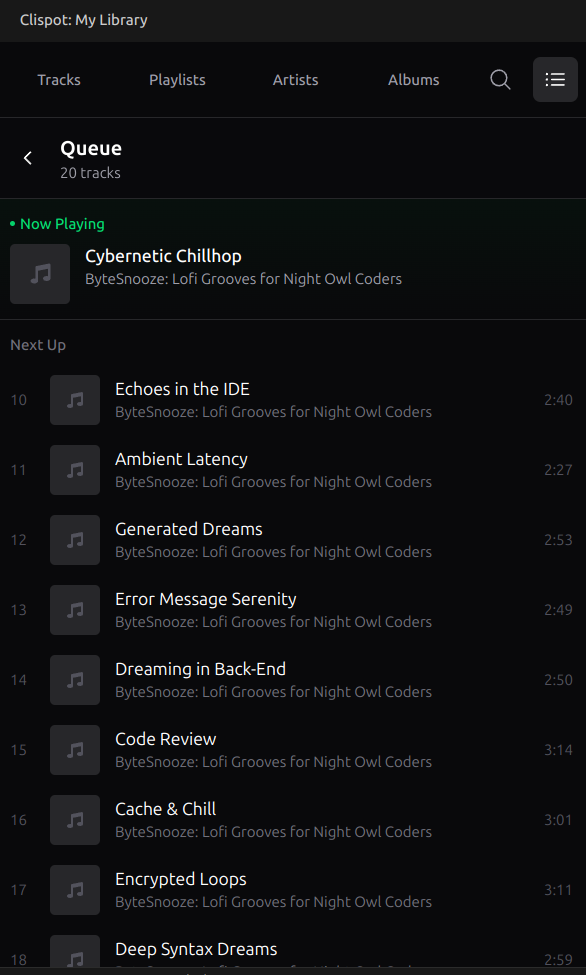

## Prerequisites

Before using the extension, ensure you have completed the following steps:

:::caution[Single Instance Requirement]
Clispot cannot run multiple instances simultaneously. **You must close any other running `clispot` processes** (e.g., in your terminal) before using the extension.
:::

1.  **Install Clispot CLI**: Download the latest release from [GitHub](https://github.com/kumneger0/clispot/releases/latest).
    :::caution[Version Requirement]
    The extension requires Clispot CLI **v0.4.0** or newer. Please upgrade if you are using an older version.
    :::

2.  **Configure Credentials**: You **must** set up a Spotify Developer Application and export your `SPOTIFY_CLIENT_ID` and `SPOTIFY_CLIENT_SECRET`. See the [Configuration Guide](/core/configuration) for instructions.
3.  **Authenticate**: On the first run, Clispot will open your browser to authenticate with your Spotify account. This is a one-time process.

## Installation

You can install the **Clispot** extension directly from VS Code:

1.  Open VS Code.
2.  Go to the **Extensions** view (`Ctrl+Shift+X`).
3.  Search for `Clispot`.
4.  Click **Install**.

Alternatively, you can install it from the [Visual Studio Marketplace](https://marketplace.visualstudio.com/items?itemName=kumnegerwondimu.clispot).

## Getting Started

1.  Open VS Code.
2.  The extension will automatically start the Clispot backend service in the background.
3.  Click the **Clispot** icon in the Activity Bar (sidebar) to open your library.

## Features

### Library View
Access your Spotify library directly from the sidebar. You can view:
- **Playlists**: Browse and play your saved playlists.
- **Saved Tracks**: Access your liked songs.
- **Followed Artists**: Browse your favorite artists.
- **Albums**: Browse your favorite albums.
- **Search**: Search for tracks, artists, playlists and albums.

### Queue Management
Manage your music queue directly from the interface:
- **Add to Queue**: Hover over any track in a list and click the <kbd>+</kbd> (plus) icon to add it to your queue.
- **Remove from Queue**: In the Queue view, hover over a track and click the <kbd>-</kbd> (minus) icon to remove it.

### Playback Control
- **Status Bar**: Shows the currently playing track and time. Click to toggle play/pause.
- **Commands**: Open the Command Palette (`Ctrl+Shift+P`) and type `Clispot` to see available commands:
    - `Clispot: Toggle Play/Pause`: Pauses or resumes playback.
    - `Clispot: Refresh Library`: Reloads your library data.

## Troubleshooting

- **"Clispot is not installed"**: Ensure the `clispot` binary is in your system PATH.
- **Server issues**: The extension runs `clispot --headless` in a background terminal. If the extension fails to start the backend automatically, try running `clispot --headless` manually in your terminal before using the extension. If issues persist, try restarting VS Code.
